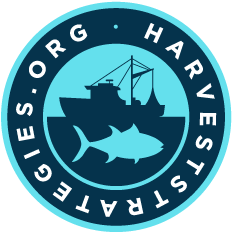
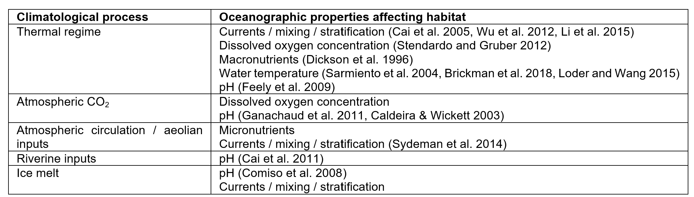
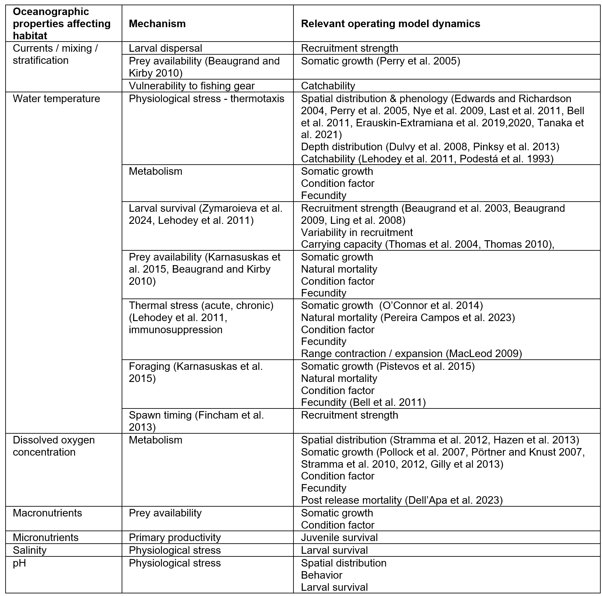
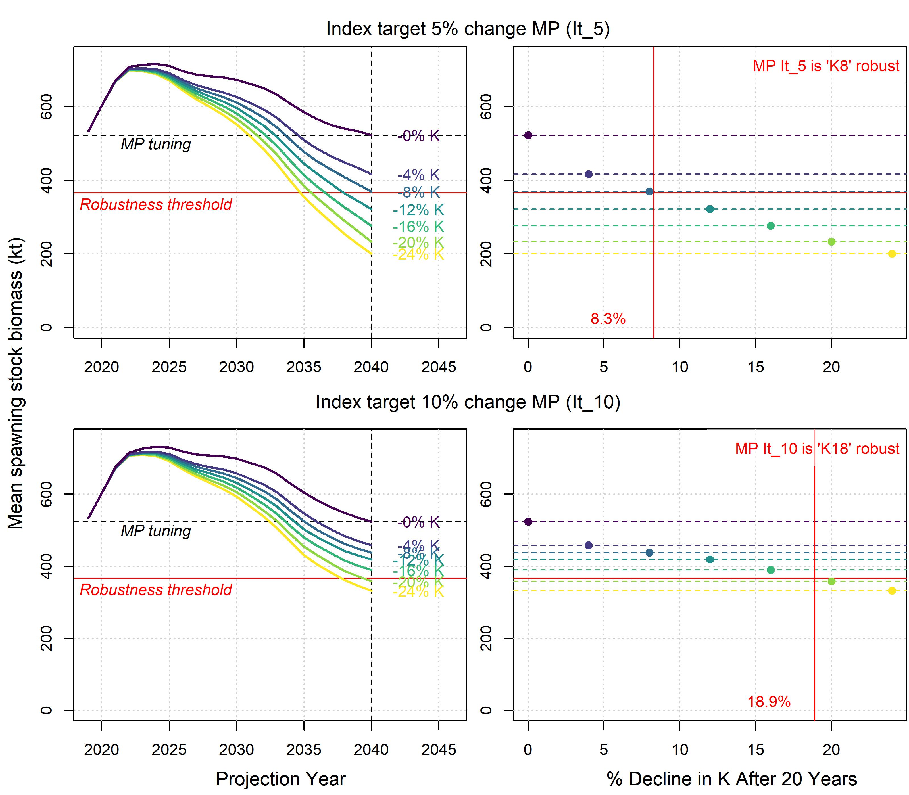

&nbsp;

<style>
  .col2 {
    columns: 2 200px;         /* number of columns and width in pixels*/
    -webkit-columns: 2 200px; /* chrome, safari */
    -moz-columns: 2 200px;    /* firefox */
  }
  .col3 {
    columns: 3 100px;
    -webkit-columns: 3 100px;
    -moz-columns: 3 100px;
  }
  .col4 {
    columns: 4 100px;
    -webkit-columns: 4 100px;
    -moz-columns: 4 100px;
  }
  .hanging-indent {
      text-indent: -1.5em; 
      padding-left: 1.5em; 
  }
</style>

<style type="text/css">

body{ /* Normal  */
   font-size: 12px;
}
td {  /* Table  */
   font-size: 12px;
}
h1 { /* Header 1 */
 font-size: 18px;
 color: DarkBlue;
}
h2 { /* Header 2 */
 font-size: 15px;
 color: DarkBlue;
}
h3 { /* Header 3 */
 font-size: 24px;
 color: DarkBlue;
}
code.r{ /* Code block */
  font-size: 12px;
}
pre { /* Code block */
  font-size: 12px
}
</style>


***


***

&nbsp;

[](https://www.bluematterscience.com/)
[](https://openmse.com/)
[](https://harveststrategies.org/)


***

```{r setup, include=FALSE}
library(dplyr)
library(kableExtra)
library(viridis)
library(DT)
library(data.table)
library(plotly)

# --- Source code for OM modifications and performance metrics -------------------

source('../R/Results.r')

types = c("M", "R", "K","S","C") 
desc = c("Natural mortality","Recruitment level", "Somatic growth", "Spatial / catchability","Condition factor")
ntypes = length(types)
Blist = lapply(1:ntypes,function(X,types)readRDS(paste0("G:/Shared drives/BM shared/1. Projects/ClimateTest/Results/Performance/",types[X],"_PGKstat.rds")),types=types)
names(Blist) = types

MPdesc = paste(rep(c("Index target","Index ratio","Index slope"),each=2),c("5% change","10% change"))

tab = CT_tabulate(Blist, targlev=0.7, subset = c(1,2,3,5))
tab = cbind(Management_procedure = MPdesc,tab )

makeCTtab = function(tab){
   labs = colnames(tab)[2:ncol(tab)]
   sketch = htmltools::withTags(table(
        class = 'display',
        thead(
          tr(
            th(rowspan = 2, 'Management Procedure'),
            th(colspan = nrow(tab)-1, "Climate Test")
            ),
          tr(
            lapply(labs, th)
          )
        )
   
      ))
  
  
  dt<-datatable(tab,caption=NULL,rownames = F,container=sketch) 
  nbk <- 1000
  clrs <- rainbow(nbk + 1, start=0.03,end=0.23)
  for(j in 2:ncol(tab)){
    brks <- seq(0,max(tab[,j]),length.out=nbk)
    dt <- formatStyle(dt, columns = j, backgroundColor = DT::styleInterval(brks, clrs))# ,'text-align' = 'center')
  }
 
  dt

}

knitr::opts_chunk$set(echo = FALSE)

maketab <- function(dir,Alab="Statistical Area"){
  filenam = list.files(dir)
  nf = length(filenam)
  DF = data.frame(filenam)
  names(DF) = c("Area")
  #filepath = list.files(dir, full.names = T, include.dirs = T)
  fit.link = paste0('<a href=', file.path(dir, filenam), '> ', DF$Area , ' </a>')
  DF$Area <- fit.link
  DT::datatable(DF, escape=1,
                colnames=c(Alab),
                filter = 'top',
                options = list(
                  pageLength = 10, 
                  autoWidth = TRUE,
                  sDom  = '<"top">lrt<"bottom">ip'))
}


plotatab <- function(filey,sheet,head=T){
  if(head){
    dat = read_xlsx(paste0(getwd(),"/",filey),sheet)
    kable(dat,"simple") 
  }else{
    dat = read_xlsx(paste0(getwd(),"/",filey),sheet,col_names=F)
    kable(dat,"simple",col.names=rep("",ncol(dat))) 
  }
}


getprojectinfo<-function(page){
  tab=as.data.frame(read_excel("project_Info/Status Assumptions To do.xlsx", sheet = page))
  tab=tab[,2:3]
  tab[is.na(tab)]=""
  kable(tab,"simple")#,col.names=rep("",2)) 
}
  

getprog<-function(page){
  tab=as.data.frame(read_excel("Project_Info/Progress.xlsx", sheet = page))
  tab=tab[,2:3]
  tab[is.na(tab)]=""
  kable(tab,"simple")#,col.names=rep("",2)) 
}
 

```


# Overview

Forecasts of climate impacts on marine populations have often struggled to pass peer-review. Typically, those forecasts are also highly uncertain. These forecasting challenges have proven an impediment to the adoption of fishery management practices that are considerate of climate change. 

To alleviate the need for a defensible forecast, the Climate Test rephrases the problem, focusing on the relative performance of management options given increasingly extreme climate scenarios. This is analogous to testing pilots in a simulator. It is possible to simulation test and then rate pilots according to their ability to fly under increasingly challenging weather conditions. This pilot rating process is unrelated to a particular weather forecast.  

The aim of Climate Test is to provide strategic information to fishery managers about the relative climate robustness of various candidate management options. For a set of candidate management procedures that are otherwise comparable, managers have the option of adopting a procedure that has been show to withstand more extreme climate tests. 

***

# Project Details

<span style="color: #7690ba;">Title: 'Create and demonstrate a practical, science-based framework that enables fisheries managers to evaluate and adopt climate-resilient management procedures'</span>


```{r ProjDets, eval=T}
dat<-data.frame(c("Term","Funded by","Coordinated by","Initiative","Project Partners","TOF Project Leader","Blue Matter Team","UCT Collaborators"),
                
                 c("Sept 2025 - Nov 2027",
                   "Paul M. Angell Family Foundation, Oceankind, The Pew Charitable Trusts",
                   "The Ocean Foundation (TOF)",
                   "www.HarvestStrategies.org",
                   "Blue Matter Science Ltd., University of Cape Town (UCT)",
                   "Rebecca Scott",
                   "Tom Carruthers, Adrian Hordyk, Quang Huynh",
                   "Carryn de Moor, Kelly Ortega-Cisneros"))

kable(dat,"simple",col.names=rep("",2)) 

```

***

# Introduction

## Hypothesized Climate Impacts on Exploited Marine Populations

Changing climatic conditions have the potential to substantially alter the abundance, productivity and species composition of pelagic marine ecosystems (Beaugrand and Kirby 2023, Bell et al. 2011). Due to increasing anthropogenic greenhouse gas emissions, climate processes affecting marine ecosystems are forecasted to intensify (Hoehy-Guldberg et al. 2018; Kwiatkowski et al., 2020). 

Climate processes (e.g., thermal regime, concentration of greenhouse gasses) are linked to oceanographic conditions (e.g., ocean temperature, ocean mixing, stratification, pH & salinity)(Figure 1, Table 1). A large number of mechanisms have been proposed for how individual fish stocks may be impacted by those changing oceanographic conditions (Table 2). The mechanistic linkages are numerous and can related to changing ecological processes (e.g., primary productivity, community dynamics) and the location and amount of suitable habitat. The large number of mechanisms ultimately impact a relatively concise list of individual stock dynamics relating to species distribution, survival of various life stages, condition factor, fecundity and somatic growth (Walther et al., 2002; Doney et al., 2012; Free et al., 2019). 


<span style="color: #7690ba;">Figure 1. A simplified diagram of linkages among climate processes, oceanographic conditions and individual species dynamics. The size of each box is intended to represent the relative number of processes / mechanisms that have been proposed in the literature, highlighting the relatively small number of hypothesized impacts on individual species.</span>   

<br>


In their review of impacts on large pelagic fish in the Northwest Atlantic, Dell’Apa et al. (2023) provide a useful example of changes in ocean conditions that may impact stock dynamics: 

“... the Northwest Atlantic Ocean has been characterized by several climate-driven changes in regional environmental conditions over recent decades, including warmer sea surface temperature (SST) (Karnauskas et al., 2013; Loder and Wang, 2015) and bottom water temperature (Brickman et al., 2018), increased summertime stratification of shelf waters (Li et al., 2015), changes in dissolved oxygen concentration (DO) levels (Stendardo and Gruber, 2012) and acidification (Cai et al., 2011), and altered oceanographic processes (Karnauskas et al., 2015)”.

Establishing climate-ready management is a key priority for many regional fishery management organizations in light of persistent declines in various species (Pacoureau et al. 2021) and concern that fishing may increase the sensitivity of marine populations to climate change (Hsieh et al. 2008).

Evaluating the climate-readiness of current and alternative management options requires models that can predict fishery and population dynamics. Unfortunately, forecasting the impacts of climate changes on managed pelagic species is highly uncertain. In theory, it is possible for example, to combine models of emissions (e.g., Algieri et al. 2023, Wang et al. 2017), earth systems (Kawamiya et al. 2020), ecosystems (e.g., Beaugrand and Kirby 2018, Lehodey et al. 2010; 2011), behaviour (e.g., Bushnell and Brill 1991, Cayré and Marsac 1993) and physiology (e.g., Gooding et al. 1981, Graham et al. 1989, Essington 2003, Checkley et al. 2009). In doing so, forecasting combines a complex series of linked projections that include greenhouse gas emissions (least uncertain), response of climate processes (uncertain), linkages with oceanographic conditions (more uncertain) and the expected impact of those on pelagic communities and individual species (most uncertain). It follows that any climate change scenario for establishing climate-ready management advice for a given fish stock is firmly hypothetical, and the relative credibility of scenarios should be considered highly uncertain.  


<span style="color: #7690ba;">Table 1. Proposed linkages between climatological processes and oceanographic properties impacting fish habitat.</span> 



<br>


This large uncertainty over climate impact scenarios poses a problem for the provision of ‘climate ready’ fishery management advice using the contemporary stock assessment and management strategy evaluation (MSE) frameworks. That is because those frameworks rely on the specification of models that represent climate impacts and the assigned credibility of those models could strongly affect the advice provided. For example, there may be small or large future changes in natural survival. Advice arising from scenarios with low survival changes would likely lead to the provision of strongly differing advice from scenarios with high natural survival, yet the relative credibility of those scenarios is not easily evaluated. 

Although there are very few quantitative forecasts of climate impacts on fisheries, qualitatively the way in which climate can impact individual populations has been hypothesized in numerous papers (Table 2). The most frequently hypothesized population changes relate to recruitment (carrying capacity, spawning habitat, larval survival), adult survival (natural mortality rate), somatic growth, spatial distribution (range contraction, catchability) age-at-maturity and condition factor (weight-at-length, fecundity). Additionally, the problematic direction of change in those variables is established: lower recruitment strength, decreased survival, lower somatic growth rate, reduced spatial distribution, older age-at-maturity and poorer condition factor. The incredibly large body of theoretical work is distilled into a very small set of single stock climate impacts. 


<span style="color: #7690ba;">Table 2. Mechanistic linkages between oceanographic properties impacting fish habitat and the dynamics of individual stocks (or operating models).</span> 



<br>

## Climate Test: Metrics of Climate Robustness

Rather than leaving the investigation of climate resilience stalled in the (perhaps indefinite) wait for scientifically defensible forecasts of climate impacts, the Climate Test presents an alternative approach. The solution proposed here is to shift the focus from forecast-based tests of climate robustness in favor of performance metrics of climate robustness. This is analogous to testing pilots in a simulator under an increasingly difficult set of weather conditions. We do not need a weather forecast to know those pilots that are better at flying in more extreme weather conditions. The Climate Test increases the degree of climate impact to identify those management options that most robust. 

## Management Strategy Evaluation

The Climate Test is proposed as an extension to management strategy evaluation (MSE), a process that has two essential components for climate test already specified: (1) models of system dynamics (operating models) and (2) candidate management options (management procedures, harvest strategies).  The intention of Climate Test is to be a straightforward addition to any MSE process established in the openMSE framework (an extension R package) allowing for climate-considerate management advice in more than 20 current MSEs.  

***

# Methods

## Robustness Threshold

The climate test compares when management options 'break' due to climate impacts and hence requires a definition of that break point, a 'Robustness threshold'. The Robustness threshold has three parts: (1) an unacceptable level of impact, (2) a quantity that is impacted and (3) a time horizon. 

In Figure 2 a climate test is presented for two management procedures for Atlantic Blue Shark (Carruthers XXX). In this case the robustness threshold is a 30% decline in spawning stock biomass (SSB) over a 30 year time horizon. The two management procedures were climate tested for declines in somatic growth (K). The top row shows how future spawning biomass is impacted by increasingly large impacts on somatic growth (phrased as annual percentage declines in K). 

The first management procedure (top row) crosses the robustness threshold after 30 years given a decline in growth of 8%. The second management procedure (bottom row) is much more robust and it takes an 18% decline in somatic growth before projected biomass crosses the performance threshold. 



<span style="color: #7690ba;">Figure 2. An exploratory climate test of decreasing somatic growth for two management procedures applied to Atlantic blueshark operating model (Carruthers 2024b)</span>

<br>


## Exploratory Tests

For any case study it is possible to create a set of marginal (one parameter at a time) climate tests to rate the climate robustness of candidate management procedures. Despite a large number of proposed mechanisms, there are only six frequently cited impacts on individual stocks and the problematic direction for management is known (Table 3)


<span style="color: #7690ba;">Table 3. Six exploratory climate tests identified in Carruthers 2024a </span>

```{r ExpTypes, eval=T}
dat<-data.frame(c("Somatic Growth","Recruitment Strength","Natural Mortality","Condition Factor","Spatial distribution","Carrying Capacity"),
                
                 c("K","R","M","C","Q","S"),
                 c("Declines in somatic growth may lead to fewer mature fecund individuals in the population, a higher fraction of fish caught per catch weight, and a lower rate of sustainable harvest",
                   "Declines in recruitment strength require fewer catches to maintain stock sizes",
                   "Declining natural survival (increasing M) reduces the number of cohorts in the population, and reduces the likelihood of reaching maturity",
                   "Declining condition factor reduces spawning biomass, increases the number of fish caught per catch weight and reduces the rate of sustainable harvest",
                   "Spatial range contration towards fishing can increase catchability (fishing efficiency) leading to higher catch per effort",
                   "Declines in carrying capacity reduce stock-wide productivity reducing sustainable catch levels")
                  )

kable(dat,"simple",col.names=c("Parameter","Code","Description")) 

```

<br>

These marginal climate tests can be used to rate MPs according to the level of climate impact before the robustness threshold is crossed. Table 4 shows four marginal tests for six example management procedures for blue shark (Carruthers 2024b). 


<span style="color: #7690ba;">Table 4. An example of exploratory climate tests of decreasing: natural survival (M), mean recruitment strength (R), condition factor (C) and somatic growth (K) for six generic management procedures applied to a Atlantic blueshark operating model (Carruthers 2024b). Numbers represent the percentage change in each exploratory test before the robustness threshold was crossed. Higher numbers indicate higher impacts and hence a more climate robust management procedure. </span>


```{r CT_Tab, eval=T, results='asis'}
makeCTtab(tab)

```

<br>


## Conceptual Test

Conceptual tests differ from exploratory tests in that they use a theoretical model to predict the combined impacts of climate at the same time. For example, rather than separately rating MP robustness given increasing the natural mortality rate (M) and reductions in somatic growth (K), the conceptual test makes a paired projection of these parameters, linking them by a theoretical ecosystem model.  

 


```{r Conceptual_diag_1, eval=T,echo=F}
  

nsim = 10
ny = 40

ylabs = 2025+(1:ny)

Kout = Mout = Kout1 = Mout1 = Kout2 = Mout2=array(NA,c(ny, nsim))
Kvar = exp(sin(seq(1,8,length.out=ny))*0.1); Kmu = 0.99^(1:ny)
Kboth = Kmu*Kvar; Mboth =1 / Kboth
for(i in 1:nsim){
  Mrand = Mboth *  rlnorm(ny,0,0.035)
  Krand = Kboth *  rlnorm(ny,0,0.035)
  Mout[,i] = Mrand/Mrand[1]
  Kout[,i] = Krand/Krand[1]
}

Kvar = exp(sin(seq(1,7,length.out=ny))*0.065); Kmu = 0.994^(1:ny)
Kboth = Kmu*Kvar; Mboth =1 / Kboth
for(i in 1:nsim){
  Mrand = Mboth *  rlnorm(ny,0,0.03)
  Krand = Kboth *  rlnorm(ny,0,0.03)
  Mout1[,i] = Mrand/Mrand[1]
  Kout1[,i] = Krand/Krand[1]
}

Kvar = exp(sin(seq(1,6,length.out=ny))*0.04); Kmu = 0.9995^(1:ny)
Kboth = Kmu*Kvar; Mboth =1 / Kboth
for(i in 1:nsim){
  Mrand = Mboth *  rlnorm(ny,0,0.02)
  Krand = Kboth *  rlnorm(ny,0,0.02)
  Mout2[,i] = Mrand/Mrand[1]
  Kout2[,i] = Krand/Krand[1]
}

coly = rev(rainbow(4,start=0,end=0.35)[c(1,2,4)])
cols = rep(coly,each=nsim*ny)
allM = c(as.vector(Mout2),as.vector(Mout1),as.vector(Mout))
allK = c(as.vector(Kout2),as.vector(Kout1),as.vector(Kout))

#par(mfrow=c(2,2))
#plot(Kboth); plot(Krand)
#plot(Mboth); plot(Mrand)
     
coll = rep(coly,each=ny); coll[ny+(0:1)] = "#ffffff00";coll[(ny*2)+(0:1)] = "#ffffff00"
  data = data.frame(M = c(Mout2[,1],Mout1[,1],Mout[,1]), K=c(Kout2[,1],Kout1[,1],Kout[,1]), Year = rep(ylabs,3), color=coll)
  

  plot_ly(data, x = ~K, y = ~Year, z = ~M, type = 'scatter3d', mode = 'lines',
                 opacity = 0.9, line = list(width = 8, color = ~color, reverscale = FALSE))   


```

<span style="color: #7690ba;">Figure 3. Three individual future projections of natural mortality rate (M, increasing) and somatic growth rate (K, decreasing). The two parameters are negatively correlated, and constrained theoretically by the equations of the ecosystem model. The three lines represent three individual projections at low, medium and high climate impacts (green, orange, red). Changes are phrased as a mulitple of current levels (e.g. they start at 1 in 2024).</span> 

<br>


```{r Conceptual_diag, eval=T,echo=F}
 
datas = data.frame(M = allM, K=allK, Year = rep(ylabs,nsim*3), color=cols)

plot_ly(datas, x = ~K, y = ~Year, z = ~M, type = 'scatter3d', mode = 'markers',
        opacity = 0.6, marker = list(size = 4.5, color = ~color, reverscale = FALSE))


```

<span style="color: #7690ba;">Figure 4. As Figure 3 but including the projected values of 10 simulations combined.</span>

In combined tests, all parameters change with increasing climate impact so results are easily presented graphically along a continuum of climate impact (Figure 5). 


```{r Conceptual_perf, eval=T,echo=F}

nCT = 40
SST = seq(0,1,length.out=nCT)
MP1 = exp(sin(seq(1.5,2.5,length.out=nCT))*0.7)
MP2 = exp(sin(seq(1.5,3.3,length.out=nCT))*0.5)
MP3 = exp(sin(seq(1.5,4.5,length.out=nCT))*0.5)
MP1 = MP1/MP1[1];MP2 = MP2/MP2[1];MP3 = MP3/MP3[1]

matplot(SST,cbind(MP1,MP2,MP3),col="white",xlab="Ocean Warming Scenario (SST increase)",
        ylab="Spawning Stock Biomass Relative to 2025"); grid()
#axis(2)
PT = 0.8
R1 = approx(MP1,SST,PT)$y; R2 = approx(MP2,SST,PT)$y; R3 = approx(MP3,SST,PT)$y; 

col2 = rev(rainbow(nCT,start=0,end=0.35))
polygon(c(-10,0,0,-10),c(-1000,-1000,1000,1000),col=col2[1])
polygon(c(10,1,1,10),c(-1000,-1000,1000,1000),col=col2[nCT])

for(i in 1:(nCT-1)){
  loc = i+c(0,1,1,0); ys = c(-1000,-1000,1000,1000)
  polygon(SST[loc],ys,col=col2[i],border=col2[i])
}

MPcols = c("black","blue","darkgrey")
matplot(SST,cbind(MP1,MP2,MP3),xlab="",ylab="",type="l",col=MPcols,add=T,lty=1,lwd=2); grid()
abline(h = 0.8,col='black',lty=2,lwd=2)
abline(v = c(R1,R2,R3),col=MPcols,lty=2,lwd=2)
text(0.13,0.77,"Robustness threshold",font=3,cex=0.9)

mtext(paste0("MP",1:3," = ",round(c(R1,R2,R3),2)),adj = c(R1,R2,R3),col=MPcols,line=0.5,cex=1.06)


```

<span style="color: #7690ba;">Figure 5. The Combined Climate test. The robustness of MPs can be rated over a finer resolution of climate impacts than presented in Figure 4 (which only had three). In this case MPs are rated according to whether they could remain above 80% of current spawning stock biomass (dashed horizontal line, with increasing ocean warming scenario). When they cross this robustness threshold they are scored according to the degrees of warming when this occurred. In this case MP1 is the most robust crossing the robustness threshold after a warming of 0.9 degrees.</span> 


<br>


## Tailored Test

Tailored tests are identical to conceptual tests but they are based on ecosystem models specified and calibrated for the particular case study stock. For example, the conceptual test might apply model-based projections for a lower trophic level pelagic fish stock. The tailored test would be an ecosystem model for the Inside Strait of Georgia with projections for Pacific herring based on the herring component of that model. 


***

# Recent presentations


[Developing the Climate Test: Robustness Trials for climate-ready management procedures. 2024 Ecosystems working group (online). SCRS/P/2024/104](papers/SCRS_P_2024_104 Carruthers Climate Test.pptx)

[Developing the Climate Test: Performance Metrics of Climate Robustness. 2024 species group meetings (Madrid / online). SCRS/P/2024/148](papers/SCRS_P_2024_148 Carruthers Climate Test Metrics.pptx)

***

# Climate Test Papers

[Carruthers, T.R.. 2024a. Developing the Climate Test: Robustness Trials for climate-ready management procedures. Col. Vol. Sci. Pap. ICCAT. 81(6): 1-26](https://www.iccat.int/Documents/CVSP/CV081_2024/n_6/CV08106104.pdf)

[Carruthers, T.R., 2024b. Developing the Climate Test: Performance Metrics of Climate Robustness. Col. Vol. Sci. Pap. ICCAT. 81(2): 1-7](https://www.iccat.int/Documents/CVSP/CV081_2024/n_2/CV08102148.pdf)

***

# References

<div class="hanging-indent">

Algieri, B., Iania, L, Leccadito, A. 2023. Looking ahead: forecasting total energy carbon dioxide emissions. Cleaner Environmental Systems. 9. https://doi.org/10.1016/j.cesys.2023.100112

Atkinson D. 1994. Temperature and organism size—a biological law for ectotherms? Adv. Ecol. Res. 3:1–58

Banks, S. C., Ling, S. D., Johnson, C. R., Piggott, M. P., Williamson, J. E., and Beheregaray, L. B. 2010.

Genetic structure of a recent climate change-driven range extension. Mol. Ecol. 19, 2011–2024. doi: 10.1111/j.1365-294X.2010.04627.x

Bell, J.D., Johnson, J.E., Hobday, A.J. 2011. Vulnerability of Tropical Pacific Fisheries and Aquaculture to Climate Change. Secretariat of the Pacific Community, Noumea, New Caledonia.

Beaugrand, G. 2009. Decadal changes in climate and ecosystems in the North Atlantic Ocean and adjacent seas. Deep Sea Res. II Top. Stud. Oceanogr. 56, 656–673. doi: 10.1016/j.dsr2.2008.12.022

Beaugrand, G., Brander, K.M., Lindley, A.J., Souissi, S., Reid, P. C. 2003. Plankton effect on cod recruitment in the North Sea. Nature Letters. 426: 661 – 664. 

Beaugrand, G., and Kirby, R. R. 2010. Spatial changes in the sensitivity of Atlantic cod to climate-driven effects in the plankton. Clim. Res. 41, 15–19. doi: 10.3354/cr00838

Beaugrand, G., Kirby, R.R. 2023. How do Marine Pelagic Species Respond to Climate Change? Theories and Observations. Annual Review of Marine Science. 2018 (10): 169-97. https://doi.org/10.1146/annurev-marine-121916063304

Bigg GR. 1996. The Oceans and Climate. Cambridge, UK: Cambridge Univ. Press

Brickman, D., Hebert, D., and Wang, Z. 2018. Mechanism for the recent ocean warming events on the Scotian Shelf of eastern Canada. Cont. Shelf Res. 156, 11–22. doi:10.1016/j.csr.2018.01.001

Bushnell, P. G., and Brill, R.W. 1991 Responses of swimming skipjack (Katsuwonus pelamis) and yellowfin (Thunnus albacares) tunas exposed to acute hypoxia, and a model of their cardiorespiratory function. Physiological Zoology. 64, 787–811.

Cai, W., Shi, G., Cowan, T., Bi, D. ,and Ribbe, J. 2005.The response  of the Southern Annular Mode, the East Australian Current, and the southern mid-latitude ocean circulation to global warming. Geophys. Res. Lett. 32,L23706.doi:10.1029/2005GL024701

Cai, W.-J., Hu, X., Huang, W.-J., Murrell, M. C., Lehrter, J. C., Lohrenz, S. E., et al. 2011. Acidification of subsurface coastal waters enhanced by eutrophication. Nat. Geosci. 4, 766–770. doi: 10.1038/ngeo1297

Caldeira. K., Wickett, M.E. 2003. Anthropogenic carbon and ocean pH. Nature 425, 365.

Carruthers, T.R. and Hordyk, A.R. 2018. Using management strategy evaluation to establish indicators of changing fisheries. Canadian Journal of Fisheries and Aquatic Sciences. DOI: 10.1139/cjfas-2018-0223

Cayré, P.F., Marsac, F. 1993. Modelling the yellowfin tuna (Thunnus albacares) vertical distribution using sonic tagging results and local environmental parameters. Aquatic Living Resources 6, 1–14.

Chang, Y.-L., Sun, C.-L., Chen, Y., Yeh, S.-Z., DiNardo, G., and Su1, N.-J. 2013. Modelling the impacts of environmental variation on the habitat suitability of swordfish, Xiphias gladius, in the equatorial Atlantic Ocean. ICES J. Mar. Sci. 70, 1000–1012. doi: 10.1093/icesjms/fss190

Checkley, D.M. Jr, Dickson, A.G., Takahashi, I. M., Radich, J.A. et al. 2009. Elevated CO2 enhances growth in young fish. Science. 324, 1683.

Chevin, L. M., Collins, S., and Lefevre, F. 2013. Phenotypic plasticity and evolutionary demographic responses to climate change: taking theory out to the field. Funct. Ecol. 27, 966–979. doi: 10.1111/j.1365-2435.2012.02043.x

Chin, A., Kyne, P. M., Walker, T. I., and McAuley, R. B. 2010. An integrated risk assessment for climate change: analyzing the vulnerability of sharks and rays on Australia’s Great Barrier Reef. Glob. Change Biol. 16, 1936–1953. doi: 10.1111/j.1365-2486.2009.02128.x

Chown, S. L., Hoffmann, A. A., Kristensen, T. N., Angilletta, M. J., Stenseth, N. C., and Pertoldi, C. 2010. Adapting to climate change: a perspective from evolutionary physiology. Clim. Res. 43, 3–15. doi: 10.3354/cr00879

Collie, J.S., R.J. Bell, S.B. Collie, C. Minto. 2021. Harvest strategies for climate-resilient fisheries. ICES J. Mar. Sci., 78 (2021), pp. 2774-2783

Comiso JC, Parkinson CL, Gersten R, Stock L. 2008. Accelerated decline in the Arctic sea ice cover. Geophys. Res. Lett. 35:L01703

Courtney, D. 2016. PRELIMINARY STOCK SYNTHESIS (SS3) MODEL RUNS CONDUCTED FOR NORTH ATLANTIC BLUE SHARK. SCRS/2015/151. Collect. Vol. Sci. Pap. ICCAT, 72(5): 1186-1232.

Courtney, D., Cortes, E., and Zhang, X. 2017. STOCK SYNTHESIS (SS3) MODEL RUNS CONDUCTED FOR NORTH ATLANTIC SHORTFIN MAKO SHARK. SCRS/2017/125 Collect. Vol. Sci. Pap. ICCAT, 74(4): 1759-1821.

Crozier, L. G., and Hutchings, J. A. (2014). Plastic and evolutionary responses to climate change in fish. Evol. Appl. 7, 68–87. doi: 10.1111/eva.12135

Dell’Apa, A., Boenish, R., Fujita, R., Kleisner, K. 2023. Effects of climate change and variability on large pelagic fish in the Northwest Atlantic Ocean: implications for improving climate resilient management for pelagic longline fisheries. Front. Mar. Sci. 10. https://doi.org/10.3389/fmars.2023.1206911

Dell’Apa, A., Carney, K., Davenport, T. M., and Vernon Carle, M. 2018. Potential medium-term impacts of climate change on tuna and billfish in the Gulf of Mexico: A qualitative framework for management and conservation. Mar. Environ. Res. 141, 1–11. doi: 10.1016/j.marenvres.2018.07.017

Dickson R, Lazier J, Meincke J, Rhines P, Swift J. 1996. Long-term coordinated changes in the convective activity of the North Atlantic. Prog. Oceanogr. 38:241–95.

Doney S. C., Ruckelshaus M., Emmett Duffy J., Barry J. P., Chan F., English C. A., et al. 2012. Climate change impacts on marine ecosystems. Ann. Rev. Mar. Sci. 4, 11–37. doi: 10.1146/annurev-marine-041911-111611

Dulvy, N. K., Rogers, S. I., Jennings, S., Stelzenmuller, V., Dye, S. R., and Skjoldal, H. R. 2008. Climate change and deepening of the North Sea fish assemblage: a biotic indicator of warming seas. J. Appl. Ecol. 45, 1029–1039. doi: 10.1111/j.1365-2664.2008.01488.x

Edwards, M., Richardson, A.J. 2004. Impact of climate change on marine pelagic phenology and trophic mismatch. Nature Letters. 430 (881-884). 

Erauskin-Extramiana, M., Arrizabalaga, H., Hobday, A. J., Cabré, A., Ibaibarriaga, L., Arregui, I., et al. 2019. Large-scale distribution of tuna species in a warming ocean.

Erauskin-Extramiana, M., Arrizabalaga, H., Cabré, A., Coelho, R., Rosa, D., Ibaibarriaga, L., et al. 2020. Are shifts in species distribution triggered by climate change? A swordfish case study. Deep Sea Res. 2 Top. Stud. Oceanogr. 175, 104666. doi: 10.1016/j.dsr2.2019.104666

Fincham, J. I., Rijnsdorp, A. D., and Engelhard, G. H. 2013. Shifts in the timing of spawning in sole linked to warming sea temperatures. J. Sea Res. 75, 69–76. doi: 10.1016/j.seares.2012.07.004

Feely RA, Doney SC, Cooley SR. 2009. Ocean acidification: present conditions and future changes in a high-CO2 world. Oceanography 22(4):36–47.

Free C. M., Thorson J. T., Pinsky M. L., Oken K. L., Wiedenmann J., Jensen O. P. 2019. Impacts of historical warming on marine fisheries production. Science 363, 979–983. doi: 10.1126/science.aau1758

Fuentes, M. M. P. B., Chambers, L., Chin, A., Dann, P., Dobbs, K., Marsh, H., et al. 2016. Adaptive management of marine mega-fauna in a changing climate. Mitig. Adapt. Strateg. Glob. Change 21, 209–224. doi: 10.1007/s11027-014-9590-3.

Fulton, E. A. (2011). Interesting times: winners, losers, and system shifts under climate change around Australia. ICES J. Mar. Sci. 68, 1329–1342. doi: 10.1093/icesjms/fsr032

Hare, J. A., Morrison, W. E., Nelson, M. W., Stachura, M., Teeters, E. J., Griffis, R. B., et al. 2016. A vulnerability assessment of fish and invertebrates to climate change on the Northeast U.S. Continental Shelf. PloS One 11, e0146756. doi: 10.1371/journal.pone.0146756

Hoegh-Guldberg O., Jacob D., Taylor M., Bindi M., Brown S., Camilloni I., et al. 2018. “Impacts of 1.5°C global warming on natural and human systems,” in Global Warming of 1.5°C An IPCC special report on the impacts of global warming of 1.5°C above pre-industrial levels and related global greenhouse gas emission pathways, in the context of strengthening the global response to the threat of climate change. Eds. Masson-Delmotte P. Z. V., Zhai P., Pörtner H. O., Roberts D., Skea J., Shukla P. R., et al (Geneva: IPCC), 175–311.

Hollowed, A.B,  K.K. Holsman, A.C. Haynie, A.J. Hermann, A.E. Punt, K. Aydin, J.N. Ianelli, S. Kasperski, W. Cheng, A. Faig, K.A. Kearney, J.C.P. Reum, P. Spencer, I. Spies, W. Stockhausen, C.S. Szuwalski, G.A. Whitehouse, T.K. Wilderbuer. 2020. Integrated modeling to evaluate climate change impacts on coupled social-ecological systems in Alaska. Front. Mar. Sci., 6, p. 775

Hordyk, A.R., Huynh, Q.C., Carruthers, T.R. 2024. OpenMSE: open-source tools for management strategy evaluation. Available from: https://openmse.com/, https://github.com/Blue-Matter/openMSE and https://cran.r-project.org/package=openMSE.

Huynh, Q., Carruthers, T., Taylor, N.G. 2022. EcoTest: a proof of concept for evaluating ecological indicators in multispecies fisheries  , with the Atlantic longline fishery case study. SCRS/2022/106. 

Huynh, Q., Carruthers, T. 2023. Spatial distribution of multispecies longline catch per unit effort. SCRS/2023/037. 

Hsieh, C. H., Reiss, C. S., Hewitt, R. P., and Sugihara, G. 2008. Spatial analysis shows that fishing enhances the climatic sensitivity of marine fishes. Can. J. Fish. Aquat. Sci. 65, 947–961. doi: 10.1139/f08-017

Essington, T.E. 2003. Development and sensitivity analysis of bioenergetics models for skipjack tuna and albacore: A comparison of alternative life histories. Transactions of the American Fisheries Society 132, 759–770.

Free, C.M., T. Mangin, J. Wiedenmann, C. Smith, H. McVeigh, S.D. Gaines. 2023. Harvest control rules used in US federal fisheries management and implications for climate resilience. Fish Fish., 24, pp. 248-262

Ganachaud, A.S., Gupta, A.S., Orr, J.C., Wijffels, S.E., Ridgway, K.R., Hemer, M.A., Maes, C., Steinberg, C.R., Triollet, A.D., Qiu, B., Kruger, J.C. 2011. “Observed and expected changes to the tropical Pacific Ocean” in Vulnerability of tropical pacific fisheries and aquaculture to climate change. Eds. Bell J., Johnson J. E., Hobday A. J. (Noumea: Secretariat of the Pacific Community), 101–187.

Gilly, W. F., Beman, J. M., Litvin, S. Y., and Robison, B. H. 2013. Oceanographic and biological effects of shoaling of the oxygen minimum zone. Ann. Rev. Mar. Sci. 5, 393–420. doi: 10.1146/annurev-marine-120710-100849.

Gooding, R.G., Neill, W.H. and Dizon, A.E. 1981. Respiration rates and low-oxygen tolerance limits in skipjack tuna, Katsuwonus pelamis. Fishery Bulletin US 79, 31–47.

Graham, J.B., Lowell, R.W., Lai N.C., Laurs, R.M. 1989. O2 tension, swimming velocity, and thermal effects on the metabolic rate of the Pacific albacore, Thunnus alalunga. Experimental Biology 48, 89–94.

Karnasuskas, M., Schirripa, M. J., Craig, J. K., Cook, G. S., Kelble, C. R., Agar, J. J., et al. 2015. Evidence of climate-driven ecosystem reorganization in the Gulf of Mexico. Glob. Change Biol. 21, 2554–2568. doi: 10.1111/gcb.12894

Karnauskas, M., Schirripa, M. J., Kelble, C. R., Cook, G. S., and Craig, J. K. 2013. Ecosystem status report for the Gulf of Mexico. NMFS-SEFSC-653, 52.

Kawamiya, M., Hajima, T., Tachiiri, K. et al. 2020. Two decades of Earth system modeling with an emphasis on Model for Interdisciplinary Research on Climate (MIROC). Prog Earth Planet Sci 7, 64. https://doi.org/10.1186/s40645-020-00369-5

Kwiatkowski L., Torres O., Bopp L., Aumont O., Chamberlain M., Christian J. R., et al. 2020. Twenty-first century ocean warming, acidification, deoxygenation, and upper ocean nutrient decline from CMIP6 model projections. Biogeosciences 17, 3439–3470. doi: 10.5194/bg-17-3439-2020.

Last, P. R., White, W. T., Gledhill, D. C., Hobday, A. J., Brown, R., Edgar, G. J., et al. (2011). Long-term shifts in abundance and distribution of a temperate fish fauna: a response to climate change and fishing practices. Glob. Ecol. Biogeogr. 20, 58–72. doi: 10.1111/j.1466-8238.2010.00575.x

Lehodey, P., Bertignac, M., Hampton J., Lewis, A., Picaut, J. (1997). El Niño Southern Oscillation and tuna in the western Pacific. Nature 389, 715–717. doi: 10.1038/39575.

Lehodey, P., Hampton, J., Brill, R. W., Nicol, S., Senina, I., Calmettes, B., et al. 2011. “Vulnerability of oceanic fisheries in the tropical Pacific to climate change,” in Vulnerability of tropical pacific fisheries and aquaculture to climate change. Eds. Bell J., Johnson J. E., Hobday A. J. (Noumea: Secretariat of the Pacific Community), 447–506.

Lehodey P, Murtugudde R and Senina I.2010. Bridging the gap from ocean models to population dynamics of large marine predators: A model of mid-trophic functional groups. Progress in Oceanography 84, 69–74.

Lehodey P., Senina I., Calmettes B., Hampton J., Nicol S. (2013). Modelling the impact of climate change on Pacific skipjack tuna population and fisheries. Clim. Change 119, 95–109. doi: 10.1007/s10584-012-0595-1

Lehodey P., Senina I., Nicol S., Hampton J. (2015). Modelling the impact of climate change on South Pacific albacore tuna. Deep Sea Res. 2 Top. Stud. Oceanogr. 113, 246–259. doi: 10.1016/j.dsr2.2014.10.028

Li, Y., Frantantoni, P. S., Chen, C., Hare, J. A., Sun, Y., Beardsley, R. C., et al. 2015. Spatio-temporal patterns of stratification on the Northwest Atlantic shelf. Prog. Oceanogr. 134, 123–137. doi: 10.1016/j.pocean.2015.01.003

Ling, S. D., Johnson, C. R., Frusher, S., and King, C. K. 2008. Reproductive potential of a marine ecosystem engineer at the edge of a newly expanded range. Glob. Chang. Biol. 14, 1–9. doi: 10.1111/j.1365-2486.2008.01543.x

Loder, J. W., and Wang, Z. (2015). Trends and variability of sea surface temperature in the Northwest Atlantic from three historical gridded datasets. Atmos. Ocean 53, 510–528. doi: 10.1080/07055900.2015.1071237

MacLeod, C.D. 2009. Global climate change, range changes and potential implications for the conservation of marine cetaceans: a review and synthesis. Endanger. Species Res. 7:125–36

Murawski, S.A. 1993. Climate change and marine fish distributions: forecasting from historical analogy. Trans. Am. Fish. Soc. 122(5): 647-658. 

Nicol, S., Lehodey, P., Senina, I., Bromhead, D., Frommel, A. Y., Hampton, J., et al. 2022. Ocean futures for the world’s largest yellowfin tuna population under the combined effects of ocean warming and acidification. Front. Mar. Sci. 9, 816772. doi:10.3389/fmars.2022.816772

NMFS. 2020. Atlantic Highly Migratory Species Management-Based Research Needs and Priorities (Silver Spring, MD, United State: NMFS).

Neuheimer, A. B., Thresher, R. E., Lyle, J. M., and Semmens, J. M. 2011. Tolerance limit for fish growth exceeded by warming waters. Nat. Clim. Chang. 1, 110–113. doi: 10.1038/nclimate1084.

Nye J. A., Baker M. R., Bell R., Kenny A., Halimeda Kilbourne K., Friedland K. D., et al. 2014. Ecosystem effects of the Atlantic multidecadal oscillation. J. Mar. Syst. 133, 103–116. doi: 10.1016/j.jmarsys.2013.02.006

Nye, J. A., Link, J. S., Hare, J. A., and Overholtz, W. J. 2009. Changing spatial distribution of fish stocks in relation to climate and population size on the Northeast United States continental shelf. Mar. Ecol. Prog. Ser. 393, 111–129. doi: 10.3354/meps08220

O’Brien S. M., Gallucci V. F., Hauser L. 2013. Effects of species biology on the historical demography of sharks and their implications for likely consequences of contemporary climate change. Conserv. Genet. 14, 125–144. doi: 10.1007/s10592-012-0437-8

O'Connor, M. I., Holding, J. M., Kappel, C. V., Duarte, C. M., Brander, K., Brown, C. J., et al. 2014. Strengthening confidence in climate change impact science. Glob. Ecol. Biogeogr. 24, 64–76. doi: 10.1111/geb.12218

Pacoureau, N., Rigby, C. L., Kyne, P. M., Sherley, R. B., Winker, H., Carlson, J. K., et al. 2021. Half a century of global decline in oceanic sharks and rays. Nature. 589, 567–571. doi: 10.1038/s41586-020-03173-9

Parsons, L. S., and Lear, W. H. 2001. Climate variability and marine ecosystem impacts: a North Atlantic perspective. Prog. Oceanogr. 49, 167–188. doi: 10.1016/ S0079-6611(01)00021-0 

Pereira Campos, C., Bitar, S. D. B., and Freitas, C. (2023). Uncertainties regarding the natural mortality of fish can increase due global climate change. PeerJ 11, e14989. doi: 10.7717/peerj.14989

Perry, A.I., Low, P.J., Ellis, J. R., Reynolds, J.D. 2005. Climate change and distribution shifts in marine fishes. Science 308:1912–15.

Pinsky, M. L., Worm, B., Fogarty, M. J., Sarmiento, J. L., and Levin, S. A. 2013. Marine taxa track local climate velocities. Science 341, 1239–1242. doi: 10.1126/science.1239352

Pistevos, J. C. A., Nagelkerken, I., Rossi, T., Olmos, M., and Connell, S. D. 2015. Ocean acidification and global warming impair shark hunting behaviour and growth. Sci. Rep. 5, 16293. doi: 10.1038/srep16293

Podestá, G. P., Browder, J. A., and Hoey, J. J. 1993. Exploring the association between swordfish catch rates and thermal fronts on U.S. longline grounds in the western North Atlantic. Cont. Shelf Res. 13, 253–277. doi: 10.1016/0278-4343(93) 90109-B

Pollock, M. S., Clarke, L. M. J., and Dubé, M. G. 2007. The effects of hypoxia on fishes: from ecological relevance to physiological effects. Env. Rev. 15, 1–14. doi:10.1139/a06-006

Poloczanska, E. S., Hawkins, S. J., Southward, A. J., and Burrows, M. T. 2008. Modeling the response of populations of competing species to climate change. Ecology 89, 3138–3149. doi: 10.1890/07-1169.1

Poloczanska, E. S., Brown, C. J., Sydeman, W. J., Kiessling, W., Schoeman, D. S., Moore, P. J., et al. 2013. Global imprint of climate change on marine life. Nat. Clim. Chang. 3, 919–925. doi: 10.1038/nclimate1958

Poloczanska, E. S., Burrows, M. T., Brown, C. J., Garcı́a Molinos, J., Halpern, B. S.,Hoegh-Guldberg, O., et al. 2016. Responses of marine organisms to climate change across oceans. Front. Mar. Sci. 3, 62. doi: 103389/fmars.2016.00062

Pörtner, H. O., and Knust, R. 2007. Climate change affects marine fishes through the oxygen limitation of thermal tolerance. Science 315, 95–97. doi: 10.1126/science.1135471.

Pörtner, H. O., and Peck, M. A. (2010). Climate change effects on fishes and fisheries: towards a cause-and-effect understanding. J. Fish Biol. 77, 1745–1779. doi: 10.1111/j.1095-8649.2010.02783.x

Punt, A.E., Butterworth, D.S., de Moor, C.L., De Oliveira, J.A.A., and Haddon, M. 2016. Management strategy evaluation: Best practices. Fish Fish. 17(2): 303–334. doi:10.1111/faf.12104.

Punt, A.E., Dalton, M.G., Adams, G.D., Barbeaux, S.J., Cheng, W., Her-mann, A.J., Holsman, K.K., Hulson, P.J.F., Hurst, T.P., Rovellini, A. 2023. Capturing uncertainty when modelling environmental drivers of fish populations, with an illustrative application to Pacific Cod in the eastern Bering Sea. Fisheries Research. 272(106951)

Ravier, C., Fromentin, J. M. 2004. Are the long-term fluctuations in Atlantic bluefin tuna (Thunnus thynnus) population related to environmental changes? Fish. Oceanogr. 13, 145–160. doi: 10.1111/j.1365-2419.2004.00284.x

Rijnsdorp, A. D., Peck, M. A., Engelhard, G. H., Mollmann, C., and Pinnegar, J. K. 2009. Resolving the effect of climate change on fish populations. ICES J. Mar. Sci. 66, 1570–1583. doi: 10.1093/icesjms/fsp056

Sarmiento JL, Slater R, Barber R, Bopp L, Doney SC, et al. 2004. Response of ocean ecosystems to climate warming. Glob. Biogeochem. Cycles 18:1–23

Schirripa, M. 2018. CURRENT STATUS OF THE BLUE MARLIN (MAKAIRA NIGRICANS) STOCK IN THE ATLANTIC OCEAN 2018: PRE-DECISIONAL STOCK ASSESSMENT MODEL. SCRS/2018/097. Collect. Vol. Sci. Pap. ICCAT, 75(5): 1026-1050.

Schirripa, M. 2020. CURRENT STATUS OF THE WHITE MARLIN (KAJIKIA ALBIDA) STOCK IN THE ATLANTIC OCEAN 2019: PREDECISIONAL STOCK ASSESSEMENT MODEL. SCRS/2019/110. Collect. Vol. Sci. Pap. ICCAT, 76(4): 265-292.

Schirripa, M.J. and Hordyk, A. 2020. MIGRATING THE NORTH ATLANTIC SWORDFISH STOCK ASSESSMENT MODEL TO AN UPDATED VERSION OF STOCK SYNTHESIS WITH ANALYSIS OF THE CURRENT MINIMUM SIZE REGULATION. SCRS/2020/159 Collect. Vol. Sci. Pap. ICCAT, 77(3): 654-668.

Skubel, R. A., Kirtman, B. P., Fallows, C., and Hammerschlag, N. 2018. Patterns of long-term climate variability and predation rates by a marine apex predator, the white shark. Carcharodon carcharias. Mar. Ecol. Progr. Ser. 587, 129–139. doi: 10.3354/meps12424

Stendardo, I., and Gruber, N. 2012. Oxygen trends over five decades in the North Atlantic. J. Geophys. Res. 117, C11004. doi: 10.1029/2012JC007909

Stramma, L., Prince, E. D., Schmidtko, S., Luo, J., Hoolihan, J. P., Visbeck, M., et al. 2012. Expansion of oxygen minimum zones may reduce available habitat for tropical pelagic fishes. Nat. Clim. Change 2, 33–37. doi: 10.1038/nclimate1304 

Stramma, L., Schmidtko, S., Levin, L. A., and Johnson, G. C. 2010. Ocean oxygen minima expansions and their biological impacts. Deep Sea Res. I Oceanogr. Res. 57, 587–595. doi: 10.1016/j.dsr.2010.01.005

Sydeman, W. J., García-Reyes, M., Schoeman, D. S., Rykaczewski, R. R., Thompson, S. A., Black, B. A., et al. 2014. Climate change and wind intensification in coastal upwelling ecosystems. Science 345, 77–80. doi: 10.1126/science.1251635

Tanaka, K. R., Van Houtan, K. S., Mailander, E., Dias, B. S., Galginaitis, C., O’Sullivan, J., et al. 2021. North Pacific warming shifts the juvenile range of a marine apex predator. Sci. Rep. 113373. doi: 10.1038/s41598-021-82424-9

Thomas C.D. 2010. Climate, climate change and range boundaries. Divers. Distrib. 16:488–95

Thomas C.D., Cameron A., Green R.E., Bakkenes M., Beaumont L.J., et al. 2004. Extinction risk from climate change. Nature 427:145–48.

Walther G. R., Post E., Convey P., Menzel A., Parmesan C., Beebee T. J. C., et al. 2002. Ecological responses to recent climate change. Nature 416, 389–395. doi: 10.1038/416389a

Wang, J., Wu, C., Liu, C., Gu, G. 2017. Integrated Assessment models of climate change economics. Springer. Singapore. 

Wethey, D. S., and Woodin, S. A. 2008. Ecological hindcasting of biogeographic responses to climate change in the European intertidal zone. Hydrobiologia 606, 139–151. doi: 10.1007/s10750-008-9338-8

Wu, L.X., Cai, W. J., Zhang, L. P., Nakamura, H., Timmermann, A., Joyce, T., et al. 2012 . Enhanced warming over the global subtropical western boundary currents. Nat. Clim. Chang. 2,161–166.doi:10.1038/nclimate1353

Zymaroieva, A., Bondarev, D. & Kunakh, O, Svenning, J.C., Zhukov, O. 2024. Young-of-the-year fish as bioindicators of eutrophication and temperature regime of water bodies. Environmental Monitoring and Assessment. 196. 10.1007/s10661-024-12313-x.

</div>


<br>

***


# Acknowledgements

<br>

<span style="font-size: 1.05em; display: block; text-align: center;">ClimateTest is funded by:

<span style="font-size: 1.25em; display: block; text-align: center;">The Paul M. Angell Family Foundation</span> 
<span style="font-size: 1.25em; display: block; text-align: center;">Oceankind</span>
<span style="font-size: 1.25em; display: block; text-align: center;">The Pew Charitable Trusts</span>

<span style="font-size: 1.05em; display: block; text-align: center;">and </span>

<span style="font-size: 1.25em; display: block; text-align: center;">The Ocean Foundation in partnership with [www.HarvestStrategies.org](https://harveststrategies.org/)</span>

<br>


***

&nbsp;&nbsp;&nbsp;&nbsp;&nbsp;&nbsp;&nbsp;&nbsp;&nbsp;&nbsp;&nbsp;&nbsp;

